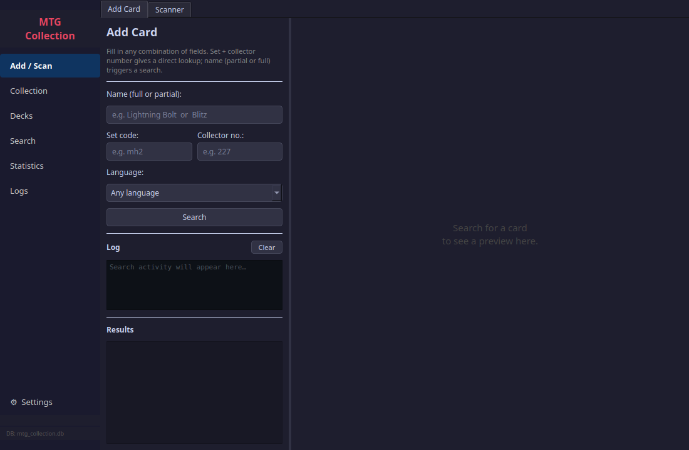
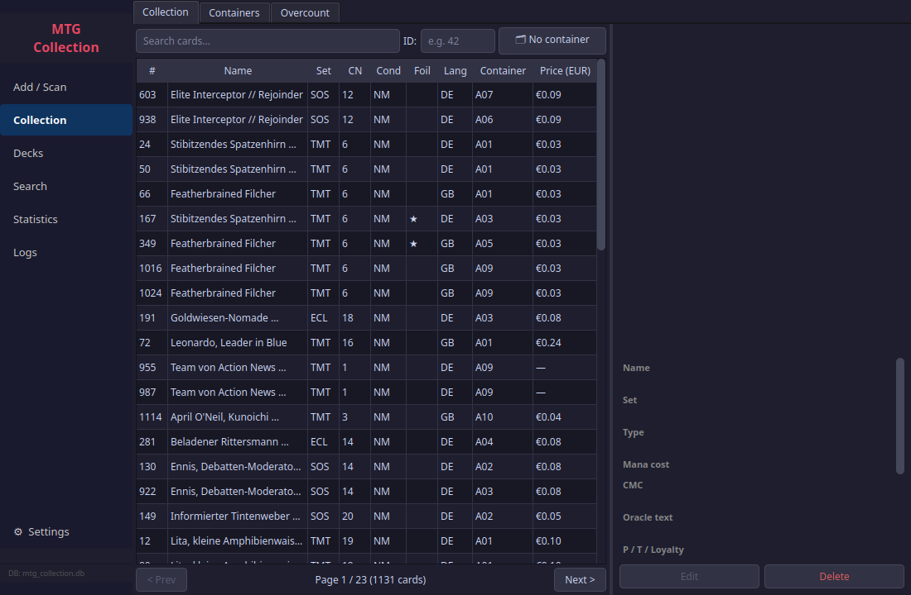
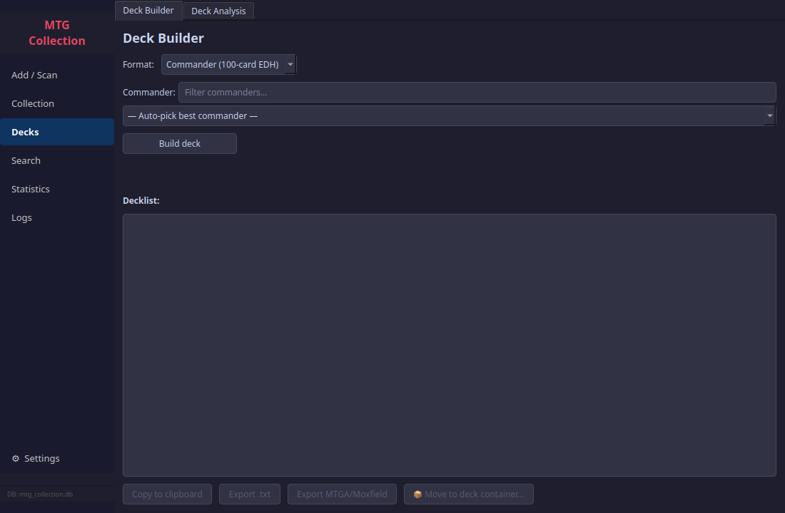
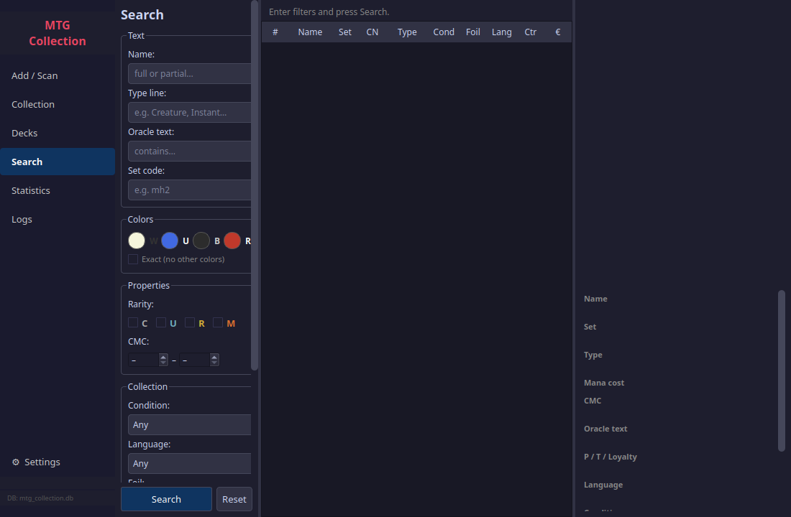
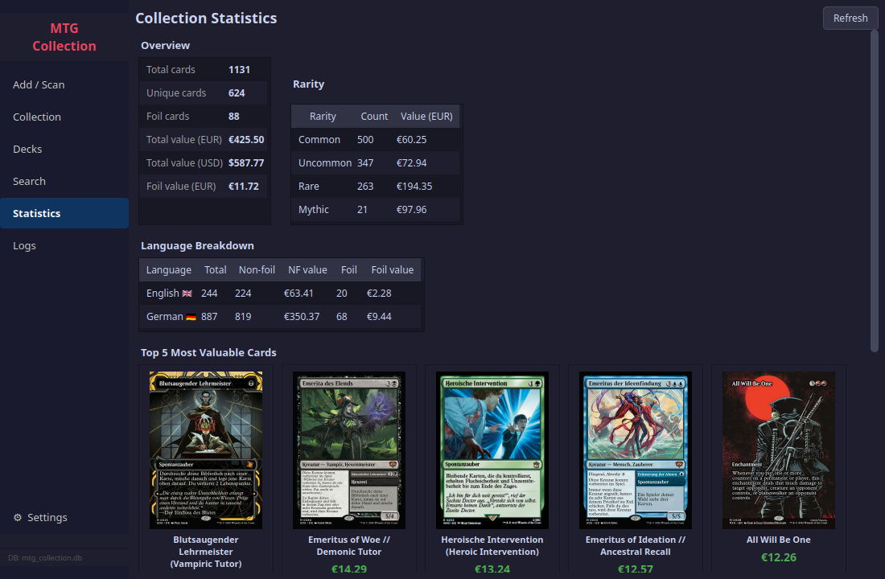

# MTG Collection Manager

A desktop application for tracking your physical Magic: The Gathering collection.
Manage cards, containers, and decks through a native PyQt6 interface — with an optional server mode
that adds a Discord bot and a browser-based web UI sharing the same database.

---

## Highlights

| | |
|---|---|
| **Card Scanner** | Webcam OCR (EasyOCR + OpenCV) — scan a physical card and it resolves via Scryfall automatically |
| **Dual price sources** | Scryfall EUR/USD prices + Cardmarket Trend/Avg30 from the official CM price guide (~25 MB, cached locally) |
| **Intelligent Deck Builder** | Builds Commander and 60-card decks from your collection; detects archetypes, scores synergy, learns from your existing decks |
| **Deck Rating** | Composite S–F grade: synergy, mana-curve fit, role coverage (Ramp/Removal/Draw/Wipes/Win-cons), archetype coherence |
| **Buylist Web Search** | Brave Search API discovers store buylist pages by keyword; matches against your collection; ranks stores by total payout and above-market offers |
| **Format Legality** | Tracks bans across Standard, Pioneer, Modern, Legacy, Vintage, Commander — with Vintage restricted support |
| **Statistics** | Collection value over time, top-10 card thumbnails, rarity/language breakdown |

---

## Screenshots

### Add & Scan
Drop in a card name or scan a physical card with your webcam — the app resolves it via Scryfall and adds it to the right container.



### Collection
Browse all your cards across Collection, Containers, and Overcount in a single tab group. Click any row to see card details on the right — including Scryfall and Cardmarket Trend prices side by side.



### Deck Builder & Analysis
Build a Commander or 60-card deck straight from your collection, or analyse an existing one for mana curve, synergies, and quality grade.



### Advanced Search
Filter by name, type line, oracle text, set, colours, rarity, Mana Value, condition, language, foil status, and container — all at once.



### Statistics
At-a-glance overview: total value, rarity and language breakdown, foil split, your top 10 most valuable cards with cover art, and a collection value chart showing EUR value over time.



---

## Quick Start

```bash
git clone https://github.com/rotzbouf/mtg-collection-manager.git
cd mtg-collection-manager
bash install.sh          # sets up venv, system deps, and config.json
bash start_desktop.sh
```

The database (`db/mtg_collection.db`) is created automatically on first launch.

> **First scan:** EasyOCR downloads its language models (~150 MB) on the very first card scan. This happens once and is cached automatically.

### Requirements

| | |
|---|---|
| Python 3.10+ | |
| PyQt6, qasync | Desktop GUI |
| aiohttp, aiosqlite | Async networking and database |
| EasyOCR, OpenCV | Card scanning (CPU-only) |
| matplotlib | Price history and statistics charts |
| Scryfall API | Card data and prices — no key required |
| Brave Search API | Buylist web search — free key at brave.com/search/api |

Full dependency list in `deps/requirements.txt`. Run `bash install.sh` to handle everything automatically.

---

## Desktop App

Launch with `bash start_desktop.sh`. Requires a display (X11 or Wayland).

### Navigation

| Section | What it contains |
|---|---|
| **Add / Scan** | Add Card (name / set / collector number lookup) · Scanner (webcam OCR) |
| **Collection** | Collection browser · Containers · Overcount |
| **Decks** | Deck Builder · Deck Analysis |
| **Search** | Full-text + multi-filter search across all fields |
| **Buylists** | Manual buylist matching · Brave web search across multiple stores |
| **Statistics** | Totals, rarity & language breakdown, top-10 by value, collection value chart |
| **Logs** | Live log stream with level filter |
| **Settings** | Config, container types, services, CM prices, buylist sources, backup / restore |

---

### Collection & Card Detail

Paginated card list with text search and ID lookup. Multi-select rows for batch move or remove. Click any card to see full details in the side panel:

- **Price (EUR)** — Scryfall market price
- **CM Trend (EUR)** — Cardmarket 7-day trend from the locally cached CM price guide
- **Price (USD)** — Scryfall USD price
- **Price History** button — opens a EUR line chart for that specific card over time

---

### Containers

Organise cards into named binders, boxes, decks, trade piles, etc. Browse cards per container; multi-select context menu for move / remove. Toggle commander status on individual cards.

---

### Overcount

Three sub-tabs:

- **Overcounted** — cards exceeding a configurable copy threshold
- **Sell Candidates** — cards in overcount containers above a price threshold, sorted by value
- **Bundle Builder** — create preset bundles (commons, uncommons, rares/mythics, by set) automatically split by language into separate containers

---

### Deck Builder

Builds Commander (99+1) or 60-card decks (Standard, Pioneer, Modern, Legacy, Vintage, Pauper) from your collection.

**What makes it smart:**

- **Up to 3 archetype variants** — detects the top archetypes in your card pool (Aggro, Control, Midrange, Ramp, Tokens, Graveyard, Combo, Spellslinger, Voltron) and builds one deck per archetype, all selectable in the UI
- **Learns from your existing decks** — cards already in your saved deck containers receive a score boost proportional to how many decks they appear in; the stats line shows "Learned from N decks"
- **Role-slot guarantees** — always includes enough Ramp, Removal, Draw, and Win-cons before curve-filling (12/10/10/4 for Commander; 4/6/4 for 60-card)
- **Pip-weighted land base** — basics distributed by mana-symbol frequency; non-basics scored and pulled from your collection (Command Tower priority, fetch/shock bonuses)
- **Commander synergy scoring** — tribal matching, trigger-pattern enablers, name-reference bonus
- **Iterative refinement** — optional hill-climbing loop swaps weakest cards for better candidates until no improvement ≥ 3 points is available
- **Power level filter** — Casual (≤ €5/card), Focused (no filter), Optimized; optional per-card price cap
- **Deck Rating** — after every build the grade (S/A/B/C/D/F, 0–100) is shown inline in the stats bar

---

### Deck Analysis

Analyse any container flagged as a deck:

- **Commander header** — commander name in large gold text with rendered SVG mana cost icons
- **Archetype badges** — colour-coded badges with confidence %, italic description, synergy and curve-fit scores
- **Deck Rating badge** — S/A/B/C/D/F grade with per-component subscores (Synergy · Curve · Roles · Coherence) and a "Missing: Ramp, Wipes" warning for uncovered roles
- **Mana curve chart** — matplotlib bar chart with dashed ideal-curve overlay (dark theme)
- **Card list** — full table with Mana Value, type, price, and container origin; sortable

#### Rating formula

| Component | Weight | Measures |
|---|---|---|
| Synergy | 25 % | Pairwise card synergy (normalized) |
| Curve fit | 25 % | Cosine similarity to archetype ideal curve |
| Role coverage | 30 % | Ramp / Removal / Draw / Board Wipes / Win-cons present above format minimums |
| Coherence | 20 % | Archetype detection confidence |

Grades: **S** ≥ 90 · **A** ≥ 75 · **B** ≥ 60 · **C** ≥ 45 · **D** ≥ 30 · **F** < 30

---

### Buylists

Two modes for comparing your collection against store buylists:

#### Manual
Paste a buylist URL or raw text (tab-separated table copy or HTML). The app fetches the page, parses it, and cross-references your collection. Results show:
- **Buylist price vs. Market price** — green if the store offers ≥ 80 % of market, red if below
- **Summary bar** — total cards on the buylist, matches found, total buylist value, total market value
- **Card image preview** — selecting any row shows the card image in a side panel
- **Saved sources** — store URLs saved in Settings appear as a quick-select combo

#### Web Search (Brave API)
Enter a keyword (e.g. "MTG Karten Ankauf Buylist") and let the app discover buylist pages automatically:

1. Brave Search API returns URLs, sorted by buylist likelihood (URL/title/description hints)
2. Each page is fetched and parsed through the same buylist parser
3. Results are **matched against your collection** per store
4. **Store Ranking table** — stores sorted by total buylist payout:

| Column | Description |
|---|---|
| Store | Page title + URL tooltip |
| Matches | Cards from your collection found on this buylist |
| BL Total | Sum of buylist prices × count you own |
| MKT Total | Sum of market prices × count you own |
| Above Market | Cards where the store pays ≥ 80 % of market (green) |

Selecting a store shows its matching cards in the detail panel with the same BL/MKT color coding and card image preview.

Keywords and API key are configured in **Settings → Buylists → Brave Web Search**.

---

### Cardmarket Price Integration

- **Sync CM Prices** (Settings → Maintenance) — downloads the official Cardmarket price guide (~25 MB) and stores it in a local `cm_prices` table; every card shows `CM Trend` and `CM Avg30` in its detail panel
- **Backfill CM IDs** — fetches Scryfall data for collection cards missing a Cardmarket ID (runs once; the daily Scryfall sync keeps new cards updated)
- The `collection_with_prices` view joins Scryfall and CM data — queries throughout the app automatically see both

---

### Format Legality & Bans

- **Format bans table** rebuilt from fresh Scryfall legality data on every daily sync
- Covers Standard, Pioneer, Modern, Legacy, **Vintage** (restricted list), Commander
- **Settings → Bans** tab — view and manage per-format ban overrides for cards that aren't correctly classified

---

### Statistics

- **Overview** — total count, unique cards, foil split, total EUR / USD value
- **Rarity breakdown** — count and EUR value per rarity tier
- **Language breakdown** — totals and foil split per language
- **Top 10 most valuable cards** — thumbnails with names and prices in a 2-row grid
- **Collection value over time** — inline EUR line chart from daily price snapshots

---

## Features at a Glance

| Category | Details |
|---|---|
| **Add by name** | Resolves EN or DE card names via Scryfall; auto-detects language |
| **Card Scanner** | Webcam isolation (OpenCV) + OCR (EasyOCR CPU / pytesseract fallback); full debug trace mode |
| **Dual prices** | Scryfall EUR/USD + Cardmarket Trend/Avg30 — shown side by side in card detail |
| **CM price sync** | Daily bulk download of Cardmarket price guide, cached locally; backfill for existing cards |
| **Full-text search** | SQLite FTS5 across name, type, oracle text, set, flavour text, notes |
| **Chaos sort** | MTG colour order: W → U → B → R → G → Multi → Colourless → Land, then type, then MV |
| **Price history (per card)** | Daily EUR snapshots; chart dialog from any card detail panel |
| **Collection value chart** | Aggregate EUR value over time in Statistics |
| **Format legality** | Ban tracking for 6 formats with Vintage restricted support |
| **Deck Builder** | Archetype variants, synergy scoring, role slots, pip-weighted lands, iterative refinement |
| **Deck learning** | Boosts cards already proven in your existing deck containers |
| **Deck Rating** | S–F composite grade: synergy · curve fit · role coverage · coherence |
| **Deck Analysis** | Commander header with SVG mana icons, archetype badges, curve chart |
| **Buylists — Manual** | URL fetch or paste; BL vs. market color coding; card image preview |
| **Buylists — Web Search** | Brave API keyword search; store profit ranking; above-market highlighting |
| **Bundle builder** | Preset bundles split by language into separate containers |
| **Export** | Moxfield CSV (default), full CSV, JSON |
| **Import** | Moxfield CSV, bot-export CSV, bot-export JSON |
| **Backup & restore** | Save / restore `.db` or `.db.xz`; card and container count preview |
| **Local image cache** | Card images downloaded from Scryfall and cached locally |
| **Resync** | Re-fetches Scryfall data (text, prices, image) for one or all cards |

---

## Configuration

Settings are stored in `config.json` (excluded from git — contains your Discord token).
On first run, `install.sh` creates it from `config.json.example`.
Open **Settings → Configuration** inside the app to fill in your values.

Key settings:

| Key | Default | Description |
|---|---|---|
| `discord.token` | — | Your Discord bot token |
| `app.price_source` | `scryfall` | Price provider (`scryfall` or `cardmarket`) |
| `app.ui_port` | `8080` | Web UI port |
| `container_types` | `["binder","box","deck","commander","overcount"]` | Available container types |
| `overcount_excluded_types` | `["deck","commander","overcount"]` | Types excluded from overcount checks |
| `buylist_sources` | `[]` | Saved buylist URLs (name + url pairs) |
| `brave.api_key` | — | Brave Search API key for buylist web search |
| `brave.keywords` | `["MTG Karten Ankauf Buylist", …]` | Default search keywords |
| `brave.max_results` | `5` | Results per keyword per search |

---

## Architecture

```
core/               Shared service layer (used by all interfaces)
  database/         Async SQLite package — schema, migrations, mixin-based query modules
  scryfall.py       Scryfall API client with rate limiting and 429 backoff
  scanner/          Card isolation (OpenCV) + OCR (EasyOCR CPU / pytesseract) package
  analysis.py       Archetype detection, card scoring, mana-curve optimisation, deck rating
  deckbuilder/      Synergy scoring and deck construction package
    commander.py    Commander deck builder
    sixty.py        60-card deck builder
    refinement.py   Iterative hill-climbing refinement loop
    _roles.py       Role tagging (ramp, removal, draw, board wipe, win-con)
    _mana.py        Pip-weighted land base builder
  brave_search.py   Brave Search API client (buylist URL discovery)
  image_cache.py    Local card image cache
  sorting.py        Chaos sort key computation
  exporter.py       Moxfield CSV, full CSV, JSON serialisation
  importer.py       Moxfield CSV, full CSV, JSON parsing

desktop/            Native desktop app (PyQt6 + qasync)
  app.py            QApplication entry point
  main_window.py    Sidebar navigation, DB initialisation, daily price sync
  db.py             Shared Database + ScryfallClient singletons
  widgets/          All page widgets
    buylists.py     Manual + Brave web search buylist matching
    deck.py         Deck Builder page
    deck_analysis.py Deck Analysis page with rating badge
    card_detail.py  Reusable card detail panel (dual prices, mana icons)
    settings.py     Settings with CM prices, buylist sources, Brave API
  dialogs/          Card, container, price-history dialogs

server/             Server-only code
  bot.py            Discord bot (discord.py)
  ui/               Web UI (FastAPI + Jinja2 + HTMX)
```

### Database

| Table / View | Purpose |
|---|---|
| `collection` | One row per physical card |
| `containers` | Named storage locations (type, deck_format, color_identity) |
| `card_prices` | Normalised Scryfall EUR/USD prices per `scryfall_id` |
| `cm_prices` | Cardmarket price guide cache per `cm_id` (low, trend, avg7, avg30, foil variants) |
| `price_history` | Daily EUR price snapshots per `scryfall_id` |
| `format_bans` | Format legality overrides per card + format |
| `collection_fts` | FTS5 virtual table, auto-synced via triggers |
| `collection_with_prices` | View joining collection + card_prices + cm_prices |

WAL mode enabled. Schema migrations run automatically on startup.

---

## Server Mode — Discord Bot + Web UI

The same database can be exposed via a Discord bot for remote scanning and a local web UI for browser access.

### Setup

```bash
bash server/install.sh
# Fill in config.json (discord.token, channel IDs, etc.)
sudo bash server/mtg-discord-bot_service_install.sh
sudo bash server/mtg-webui_service_install.sh
```

**Web UI:** `bash server/start_ui.sh` → http://localhost:8080

### Discord Bot Permissions

**OAuth2 invite permission integer:** `117760`

| Permission | Why |
|---|---|
| View Channel | See channels and incoming messages |
| Send Messages | Post scan status, command responses, error messages |
| Embed Links | Send card confirmations, search results, stats, showcase |
| Attach Files | Send deck `.txt`, export CSV/JSON, backup `.db.xz`, charts |
| Read Message History | Required for showcase channel welcome embed |

Two **privileged gateway intents** must be enabled in the Discord Developer Portal:
- **Message Content Intent** — read image attachments in the scan channel
- **Server Members Intent** — resolve display names in scan confirmations

### Role-based Access

```
Admin  ≥  Collector  ≥  Guest
```

| Role | Permissions |
|---|---|
| Guest | `/list`, `/search`, `/stats`, `/showcase`, `/export`, `/browse`, `/deck propose` |
| Collector | `/add`, Browse → Edit / Move / Resync + all Guest |
| Admin | Browse → Delete, Rename container, `/resync`, `/backup` + all Collector |

### Discord Commands

**Adding cards**

| Command | Description |
|---|---|
| `/add name: [set_code:] [condition:] [foil:] [quantity:]` | Add a card by name |
| Drop image in scan channel | Auto-scan via OCR; container picker on first scan |

**Viewing**

| Command | Description |
|---|---|
| `/list [sort:] [language:]` | Browse collection (paginated, 10 per page) |
| `/search query:` | Full-text search across all fields |
| `/browse` | Interactive container and card browser |
| `/stats` | Totals, rarity breakdown, top-5 by value, per-container overview |
| `/showcase` | 5 most valuable cards with image, price, and price-history chart |

**Containers**

| Command | Description |
|---|---|
| `/container list` | All containers with card count and EUR value |
| `/container move source: destination:` | Move all cards between containers |

**Import / Export / Backup**

| Command | Description |
|---|---|
| `/export [format:]` | Moxfield CSV (default), full CSV, or JSON |
| `/import` | Moxfield CSV, bot-export CSV, or bot-export JSON |
| `/backup create` | Save server copy + send `.db.xz` attachment |
| `/backup restore` | Attach `.db` / `.db.gz` / `.db.xz` to restore |

**Deckbuilder**

| Command | Description |
|---|---|
| `/deck propose [format:] [commander:]` | Commander (100-card) or 60-card deck from your collection |

**Resync**

| Command | Description |
|---|---|
| `/resync [id:]` | Re-fetch Scryfall data; omit `id` to resync all cards |
